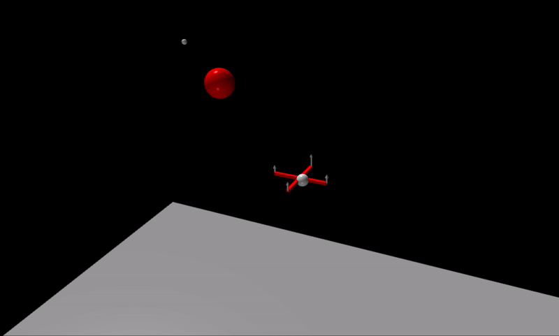

# Model Predictive Control Simulation

This software is for simulating model predictive control of systems. In particular, this was developed for simulating a controller quad-copter that autonomously navigates a field of obstacles

NOTE: This is currently a work in progress. As of 3/11/2020, the software has been demonstrated to navigate a quadcopter between two waypoints while avoiding a sphere between the waypoints (see gif below).

The goals for this software include:

1. Navigate a quadcopter between two waypoints with randomly placed spherical obstacles in the way
2. Add process noise to the system (e.g. wind) to simulate the ability of MPC to robustly control the quadcopter
3. Improve the quadcopter dynamics model with more complex dynamics (drag, etc.)
4. Add Javascript wrapper to perform simulation and display results using Three.js in an interactive manner

While this software was written for the purpose of simulating the quadcopter, the bulk of the code can be used to simulating any system with model predictive control without needing to change any of the existing code. For example, the cart-pole system has also been simulated with this software

Right now, the documentation for this software is almost nonexistent (you're looking at the bulk of it here), but a lot of the C++ source files are well commented. In the future, a more thorough documentation of the code, as well as the control theory and derivation of the quadcopter dynamics will be added.
