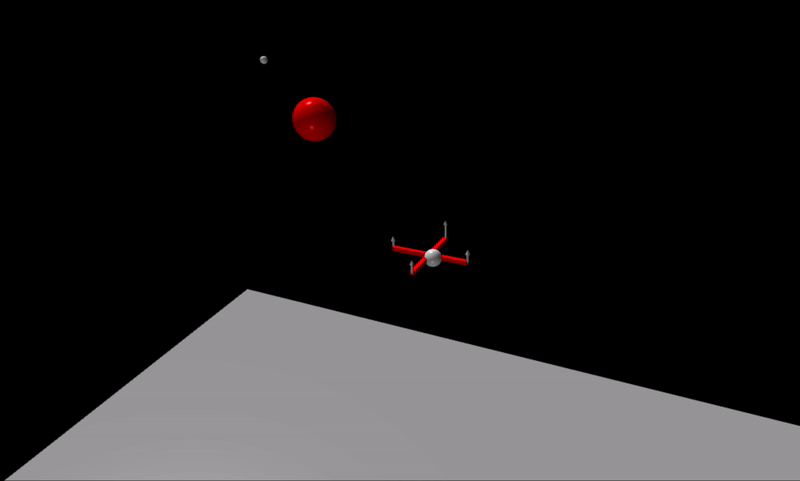
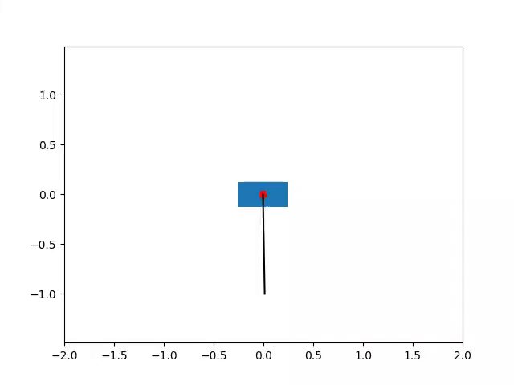

# Autonomous Aerial Vehicle Simulator
## Introduction

This software is for simulating model predictive control of autonomous aerial vehicles. In particular, this was developed for simulating a quad-copter that autonomously navigates a field of obstacles

NOTE: This is currently a work in progress. As of 3/11/2020, the software has been demonstrated to navigate a quadcopter between two waypoints while avoiding a sphere between the waypoints (see gif below).

The quadcopter is able to navigate from one point to the other by flying underneath the obstacle.

## Future Work

The goals for this software include:

- [ ] Use path planning (RRT, RRT*, A*, etc.) for high level trajectory design and then use MPC to follow path
- [ ] Navigate a quadcopter between two waypoints with randomly placed obstacles of arbitrary shape in the way
- [X] Implement regularization and adaptive learning rate in the DDP algorithm in MPC
- [ ] Add process noise to the system (e.g. wind) to simulate the ability of MPC to robustly control the quadcopter
- [ ] Improve the quadcopter dynamics model with more complex dynamics (drag, etc.)
- [ ] Add proper file IO for saving simulation data and parameters (maybe in HDF5 or JSON)
- [ ] Add Javascript wrapper to perform simulation and display results using Three.js in an interactive manner

While this software was written for the purpose of simulating the autonomous aerial vehicles, the bulk of the code optimal control part of the code was written for general purpose. For example, the cart-pole system has also been simulated with routines in this software in another project not included here.

## My Vision for the Project

My end goal for this project is to have a Javascript application that uses Three.js to visualize the simulation and allow a user to change a lot of the simualtion parameters through a nice interface. This will probably happen later down the line, since the first major milestone is to get the actual simulation code working to navigate a quadcopter through a field of obstacles.

## State of the Documentation

Right now, the documentation for this software is almost nonexistent (you're looking at the bulk of it here), but a lot of the C++ source files are well commented. In the future, a more thorough documentation of the code, as well as the control theory and derivation of the quadcopter dynamics will be added.

The programs use CMake to build the binaries, and they utilize input files for the simulation parameters so that different simulations can be run by changing the input file only. As of now, the results of the simulation are placed in a text file called `output.txt`, but proper file IO will be added later.
